## l5y

I build low-level, privacy-first systems — protocols, tooling, and the infrastructure between them. Years of open source work across security, peer-to-peer networking, and operations; always drawn to the edges where the interesting problems live. Radio enthusiast on the side. Open to interesting conversations.

